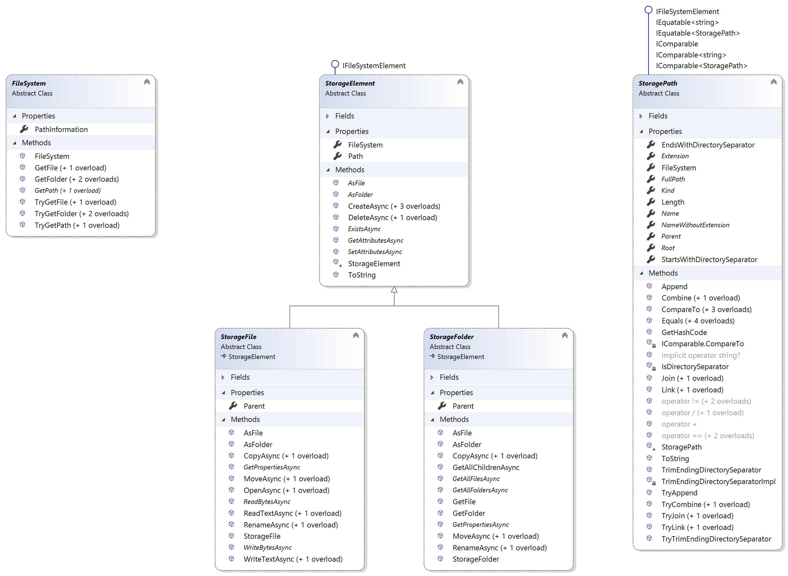

#  Files &nbsp; [](https://www.nuget.org/packages/Files) [](./LICENSE)  [](https://dev.azure.com/ManuelRoemer/Files/_build/latest?definitionId=20&branchName=master)

Files is a **modern file system abstraction** for .NET. As such, Files has the following key features:

✨ **No Tight Coupling to a Concrete File System**:<br/>
Easily switch between **different file system implementations**, including the local machine's
**physical file system**, an implementation using **UWP**'s `Windows.Storage` API and an
**in-memory** solution for **testing**!
And of course, you can easily create **your own** implementation if necessary.


✨ **Immutable by Default**:<br/>
In comparison to .NET's `FileInfo`/`DirectoryInfo` and UWP's `IStorageFile`/`IStorageFolder`,
the core members of Files are immutable by default, meaning that **no unexpected mutations** can
happen when you, for example, move a file.
Interacting with a file system suddenly becomes predictable!

✨ **Async First**:<br/>
All I/O operations are, whenever possible, **executed asynchronously**.
This prevents unexpected blocking when, for example, dealing with unexpectedly large files
or network drives.

✨ **Consistent API Design**:<br/>
Files fixes many inconsistencies of .NET's APIs.
Have you ever wondered why `System.IO.File` throws `UnauthorizedAccessException`s when a conflicting folder exists?
Why `System.IO.Directory` throws an `IOException` in the same scenario?
Why you can move directories to the same location, but get an exception when you try the same with files?
*No?* Well, nontheless, Files **fixes all of these inconsistencies** and **a lot more** (escpecially
in the UWP area) and provides a thought-through API surface, starting with class design and ending
with potential exceptions.

✨ **Thorougly Tested**:<br/>
Each `FileSystem` implementation is tested against a self-imposed specification.
The tests run on **3 different OSs** (Windows (Win32/UWP), Ubuntu, macOS) using up to
**5 different .NET SDKs** in order to catch and fix platform-specific problems (of which there are
many) and provide a **consistent developer experience**.

✨ **.NET Standard 2.0 and Polyfill Support**:<br/>
Files targets .NET Standard 2.0 and officially supports .NET Framework.
In addition, it backports several APIs which have been added to newer .NET SDKs like the
`System.IO.Path.Join(...)` method.

✨ **Extensively Documented**:<br/>
Incredible effort has been put into documenting the library's members.
You **will not find** a single public class/property/method/etc. which is not **documented via XML comments**.
This includes parameters, return types, and, most importantly, possible exceptions.<br/>
In addition, the entire library uses **Nullable Reference Types**.


## The Files Core API

The following class diagram shows the **five most important members** of the Files Core API and should
give a great overview about the library's design.
Supporting members like enums and utility extension methods are not shown in the image.


> The Files Core API (`v0.1.0`).

Explanation of the members:

**`FileSystem`**:
The central entrypoint into the API, designed with dependency injection in mind.
Mainly serves as a factory for creating the other members (`StoragePath`, `StorageFile` and `StorageFolder`).

**`StoragePath`**:
An abstraction over the file system's path behavior. Since each file system could handle paths differently,
Files provides a wrapper around the raw path strings which are typically used.

**`StorageFile`**:
Represents a file at a specific path and provides methods for interacting with it.

**`StorageFolder`**:
Represents a folder at a specific path and provides methods for interacting with it.


### Code Example

In the following, you can find two simple examples of how the Files API can be used.

```csharp
// Example 1: Creating a file in a folder and writing "Hello world!" to it.
FileSystem fs = new InMemoryFileSystem();
StoragePath tempFolderPath = fs.GetPath(KnownFolder.TemporaryData);
StoragePath helloWorldPath = tempFolderPath / "Greetings" / "HelloWorld.txt";
// Note: The '/' operator joins paths and is thus equivalent to using StoragePath.Join(...).

StorageFile file = fs.GetFile(helloWorldPath);
await file.CreateRecursivelyAsync();
await file.WriteTextAsync("Hello world!");
```

```csharp
// Example 2: Moving a folder from one location to another. Highlights what's meant by immutability.
FileSystem fs = new PhysicalFileSystem();
StorageFolder folderToMove = fs.GetFolder(KnownFolder.DocumentsLibrary / "Source");
StoragePath destinationPath = folderToMove.Path.FullPath.Parent! / "Destination";

StorageFolder movedFolder = await folderToMove.MoveAsync(destinationPath);
Console.WriteLine(folderToMove.Path); // e.g. "C:/Users/Example/Documents/Source"
Console.WriteLine(movedFolder.Path);  // e.g. "C:/Users/Example/Documents/Destination"
```

> ℹ **Note:**<br/>
> Please do not confuse the members above with UWP's `StorageFile` and `StorageFolder`.
> These two classes are completely independent of UWP and have simply been named like this (and not,
> for example, simply `File` and `Folder`) to prevent naming conflicts with .NETs `System.IO` namespace.


## Installation

Files is available on NuGet. Install it via:

```
Install-Package <Package-Name>

--or--

dotnet add <Package-Name>
```

The following table displays the available packages. All packages target **.NET Standard 2.0** at minimum:

| 📦 Package | 📃 Description |
| --- | --- |
| [`Files`](https://www.nuget.org/packages/Files)  | The base package providing the API contract and abstractions. This is always required. |
| [`Files.FileSystems.Physical`](https://www.nuget.org/packages/Files.FileSystems.Physical) | Provides a `FileSystem` implementation for the physical file system based on .NET's `System.IO` namespace. |
| [`Files.FileSystems.WindowsStorage`](https://www.nuget.org/packages/Files.FileSystems.WindowsStorage) | Provides a `FileSystem` implementation for the physical file system based on UWP's `Windows.Storage` API.<br/>**Targets `uap10.0.16299`.** |
| [`Files.FileSystems.InMemory`](https://www.nuget.org/packages/Files.FileSystems.InMemory) | Provides a configurable in-memory `FileSystem` implementation which is designed for testing members using the Files API. Despite being designed for testing, the implementation is fully functional, i.e. not stubbed. |
| [`Files.Specification.Tests`](https://www.nuget.org/packages/Files.Specification.Tests) | A set of MS Test test cases which form the specification for all `FileSystem` implementations. These tests are used to verify that the above `FileSystem` packages have been implemented correctly and are, due to their potential relevance to others, made publicly available as a package.<br/>**Please note that this specific package does not abide to any versioning conventions. While minimized, breaking changes can always happen here!** |


## Versioning

Files follows Semantic Versioning. In addition, all packages share a single version number.
A (breaking) change in any package will lead to a cascading version increment in all other packages.

While this can easily lead to a high major version, it ensures that you can at a glance determine
which Files packages are compatible with each other.
In addition, the number of breaking changes is supposed to be kept minimal. Most will typically
influence library developers (i.e. `FileSystem` implementers) and not the end user of the API.


## License

See the [LICENSE](./LICENSE) file for details.
